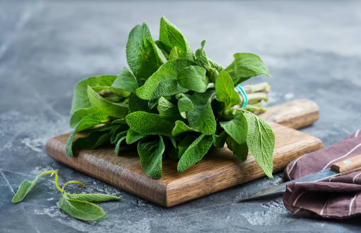
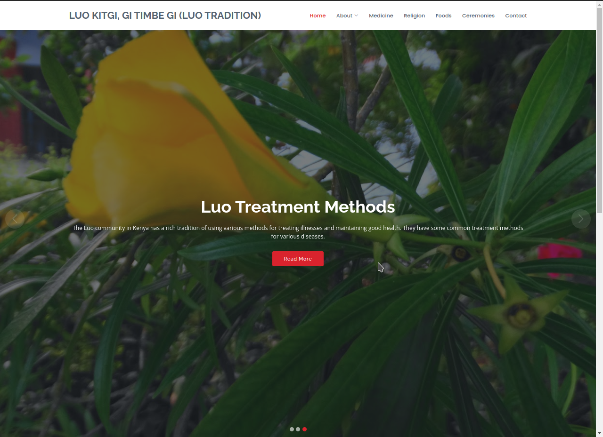
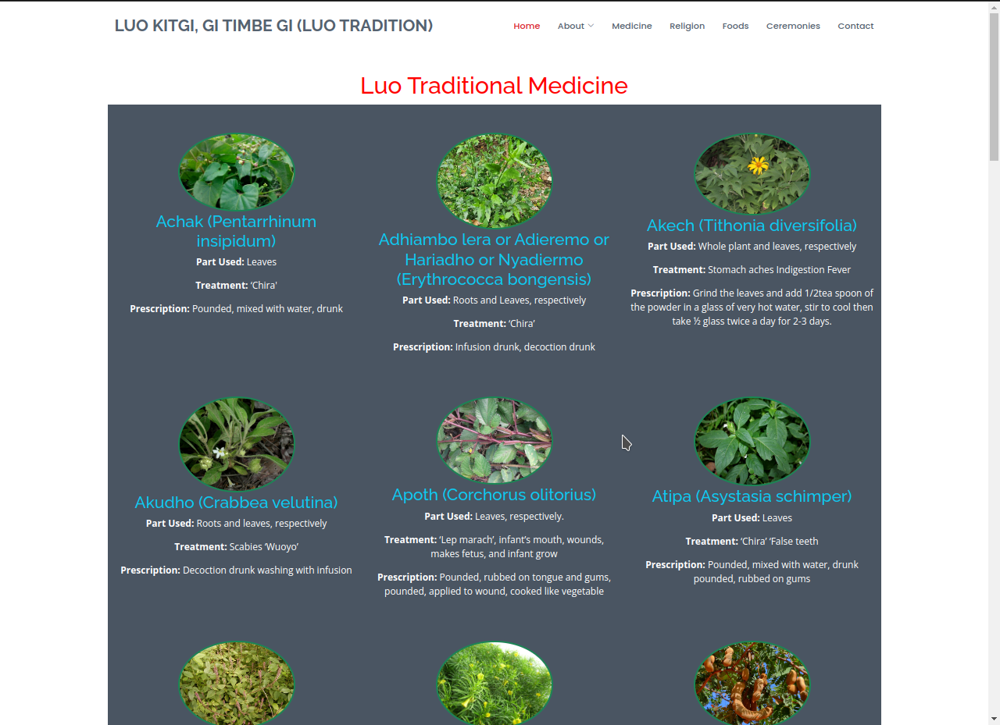
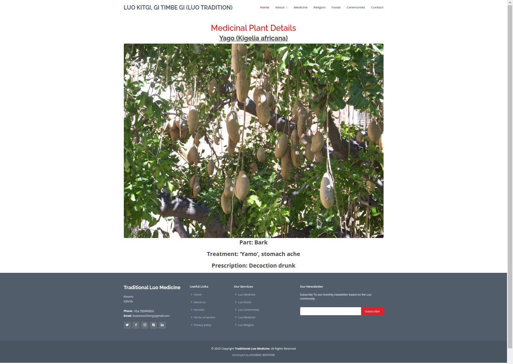

    

# Welcome to Luo Traditional Medicinal Plants and Methods
Welcome to our website dedicated to the rich and fascinating world of Luo Traditional Medicinal Plants and Methods. Here, we invite you to embark on a journey that uncovers the profound healing wisdom passed down through generations in the Luo community.

Our platform serves as a virtual gateway to the traditional medicinal practices deeply rooted in Luo culture, which have withstood the test of time and continue to hold immense significance in promoting well-being and vitality. Through meticulous research, insightful documentation, and the collaboration of passionate experts, we have curated a comprehensive repository of knowledge that celebrates the holistic approach to health and the profound connection between humans and nature.

Immerse yourself in an enchanting collection of Luo medicinal plants, each carrying a storied legacy of indigenous healing methods. From the picturesque landscapes of western Kenya to the serene shores of Lake Victoria, these age-old remedies have been nurtured and refined over centuries, honoring the intimate relationship between the Luo people and their environment.

As you delve into our website, you'll discover an array of medicinal plant profiles, detailing their uses, preparation methods, and the wisdom behind their application. From treating common ailments to addressing complex health issues, each plant holds a unique role in the broader tapestry of Luo Traditional Medicine.

Moreover, we take great pride in fostering cultural exchange and understanding. Our platform not only celebrates Luo traditional healing but also aims to promote respect for traditional knowledge systems and the preservation of endangered plant species. As stewards of this invaluable heritage, we strive to contribute to sustainable practices and the protection of the delicate ecosystems that nurture these potent medicinal treasures.

Whether you're a curious explorer seeking knowledge or a health enthusiast looking to incorporate alternative healing into your lifestyle, our website welcomes all with open arms. Join us as we celebrate the profound wisdom of Luo Traditional Medicinal Plants and Methods, offering a harmonious blend of nature, culture, and wellness that continues to inspire and enrich lives worldwide.

# Table of Contents
- [Installation](#Installation)
- [Usage](#Usage)
- [Troubleshooting](#Troubleshooting)
- [Contribution](#Contribution)
- [Credits](#Credits)
- [License](#License)

# Installation
This project run on the Django framework and 
therefore in the installation you have to create
the django virtual enviroment and install the package for 
crispy form using 
1. `pip install virtualenv`
2. `myenv\Scripts\activate.bat` or `source myenv/bin/activate`
3. `pip install django`
4. `pip install django-crispy-forms`
5. `git clone https://github.com/BOSTONE069/medical_web_app.git`
6. `python manage.py makemigrations `
7. `python manage.py migrate`
8. On local machine you can run the project using `python manage.py runserver`

# Usage
Go to the homepage http://127.0.0.1:8000/
Navigate to the to the Medecine page by clicking om the 'Medicine' button on the navigation bar
On the medicine page you can click on the varous medicines thatt have been displayed to get more information about the the medicine

# Troubleshooting
- If you have any issue regarding installation or usage, please raise an issue [here](#https://github.com/BOSTONE069/jounal_web_application)
- If you are getting any error related to crispy forms, please make sure that you have added 'crispy_forms' in your installed apps in settings.py

# Credits
- [Django](#https://www.djangoproject.com/)
- [Crispy-forms](#https://pypi.org/project/django-crispy-forms/)

# License
This project is licensed under the [MIT License](#https://www.mit.edu/~amini/LICENSE.md).

    

    

    

